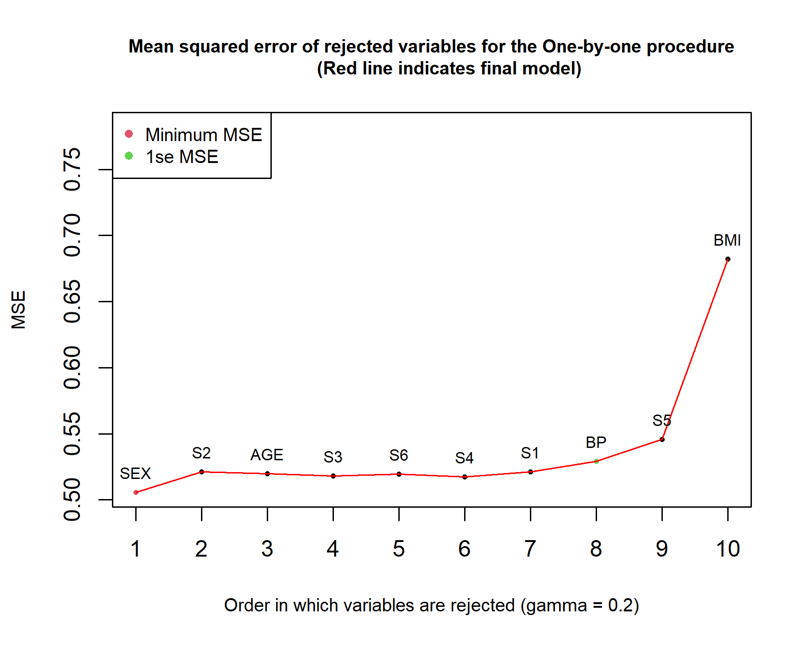

# Linear Lasso

This repository contains code for the Linear Lasso. The Linear Lasso is a method used in linear regression that finds the important predictors and calculates it coefficients based on least squares estimation. Location model methodology is udes to guide least squares analysis in the Lasso problem of variable selection and inference. In a first step, the Linear Lasso eliminates predictors based on their correlation with the response variable. In the second step (one-by-one procedure), the Linear Lasso uses backward regression with an exclusion critreion based on the variance of the y-content distribution, $c^\top C^{-1}c$.

## Description of the package

This **R** package implements the Linear Lasso which was first used in 
> Fraser, D. A., & Bédard, M. (2022). The linear Lasso: A location model approach. The Canadian Journal of Statistics, 50(2), 437-453.

Some changes have been made to optimize the algorithm.

## Example of Utilization

### Installation

The Linear Lasso algorithm can be run directly from GitHub using the devtools package function ```install_github``` using the following **R** command :

```R
devtools::install_github("yanwatts/linlasso")
```

## Setup 

To use the Lineal Lasso in linear regression, the LL function is available by specifying certain parameters
```R
LL(y, x, gamma = 0.2, K = 10, L = 10, cor.only = F, plot = F)
```

## Input 

The LL function requires minimally the following input :

* ```y``` : the vector of responses;
* ```x``` : the design matrix;
* ```gamma``` : the cutoff parameter;
* ```K``` : the number of folds for the repeated cross validation;
* ```L``` : the number of repetitions for the repeated cross validation;
* ```cor.only``` : algorithm executed only with correlations between y and x;
* ```plot``` : plot giving the path of the final model after the one-by-one procedure.

## Output 

The following is an example of the LL function used for the diabetes dataset introduced by Efron et al. (2004). The output will help us understand how to interpret the Linear Lasso algorithm. 

**First step** : LL eliminates predictors based on their correlation with the response variable

**Second step (One-by-one procedure)** : LL eliminates variables based on the one-by-one procedure

```R
> model.LL = LL(y = diabetes[,11], x = diabetes[,-11], K = 13, L = 50)
[1] "Variables left after cutoff = 0.2 : BMI + BP + S1 + S3 + S4 + S5 + S6"
```

The variables left after the first step based on the default cutoff ```gamma = 0.2``` are ```BMI```, ```BP```, ```S1```, ```S3```, ```S4```, ```S5``` and ```S6```. The model gives us the positive correlations between the response variable and the predictors,

```R
> model.LL$c.pos
      BMI        S5        BP        S4        S3        S6        S1       AGE        S2       SEX 
0.5864501 0.5658826 0.4414818 0.4304529 0.3947893 0.3824835 0.2120225 0.1878888 0.1740536 0.0430620 
```

or the table with the cross validated : mean squared errors (MSE.CV), standard deviations (SD.CV) and standard errors (SE.CV) for each rejected variable,

```R
> model.LL$table.MSE
                           
Rejected variables in order Length MSE.CV  SD.CV  SE.CV
                        S3       7 0.5178 0.1121 0.0311
                        S6       6 0.5191 0.1119 0.0310
                        S4       5 0.5171 0.1125 0.0312
                        S1       4 0.5202 0.1126 0.0312
                        BP       3 0.5278 0.1119 0.0310
                        S5       2 0.5458 0.1165 0.0323
                        BMI      1 0.6740 0.1497 0.0415 
```

or the final model with the smallest cross validated error,

```R
> model.LL$`Variables with minimum MSE`
[1] "BMI" "BP"  "S1"  "S4"  "S5" 
```

or the least squares coefficients for the minimum MSE model,

```R
> model.LL$beta.min
          [,1]
AGE  0.0000000
SEX  0.0000000
BMI  4.6706804
BP   0.3029707
S1  -0.5612210
S2   0.0000000
S3   0.0000000
S4  17.6777040
S5   8.0176759
S6   0.0000000
```

or the final model with the 1se standard rule,

```R
> model.LL$`Variables with 1se of minimum MSE`
[1] "BMI" "S5" 
```

or the least squares coefficients for the 1se standard rule model,

```R
> model.LL$beta.1se
        [,1]
AGE 0.000000
SEX 0.000000
BMI 5.274831
BP  0.000000
S1  0.000000
S2  0.000000
S3  0.000000
S4  0.000000
S5  3.561004
S6  0.000000
```

### Visualization

The following graph plots the One-by-one procedure. The first variable to exit the model after step one is ```S3```. The variables are rejected one at a time until there is only one variable left in the procedure (```BMI```).  The red line indicates the final model of the LL algorithm. 



## Author

[Yan Watts](mailto:yanwatts@hotmail.com?subject=[GitHub]%20Source%20Han%20Sans)

## References
Fraser, D. A., & Bédard, M. (2022). The linear Lasso: A location model approach. The Canadian Journal of Statistics, 50(2), 437-453.

Efron, B., Hastie, T., Johnstone, I., & Tibshirani, R. (2004). Least Angle Regression. The Annals of Statistics, 32(2), 407–451.
